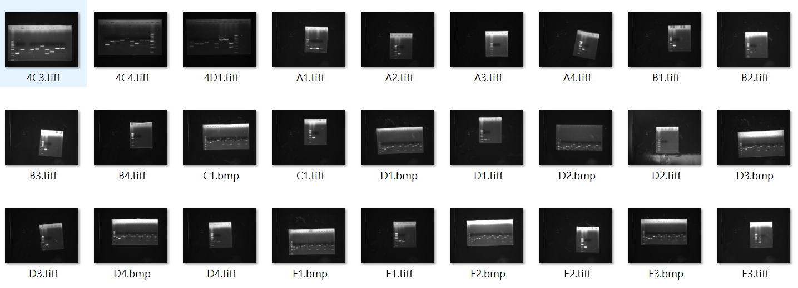
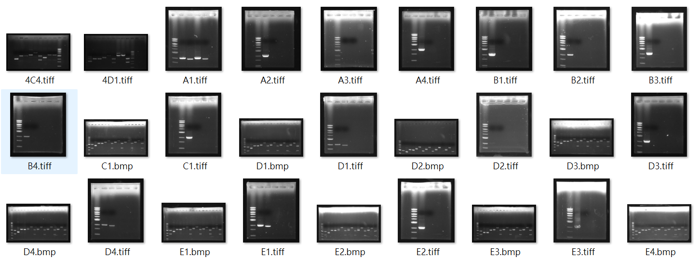

# Gel Image Auto Cropper (電泳膠片自動裁切工具)


> 🔬 A browser-based tool for automatic gel electrophoresis image cropping & rotation correction.
> No installation required — runs entirely in your browser.

**🌐 [Live Demo → allenphant.github.io/Gel-Image-Auto-Cropper](https://allenphant.github.io/Gel-Image-Auto-Cropper/)**

---

## 專案背景 (Background)

本專案最初開發於 2022 年，應用於大學部的「生物核心技術實驗」課程。該課程以 **分子生物學中心法則 (Central Dogma)** 為骨幹，引導學生學習從基因到蛋白質的完整實驗流程：

1. **基因選殖**：以 GUS 酵素基因 (GUS gene) 為標的。
2. **基因轉殖與剪接**：DNA Splicing & Gene Transfer。
3. **基因表現**：在宿主細胞 (Host Cells) 中誘導表現。
4. **檢定與純化**：檢測 mRNA 表現量，並進行蛋白質收集與純化 (Purification)。

## 問題陳述 (Problem Statement)

在實驗過程中，學生需拍攝電泳膠片 (Electrophoresis Gels) 並將其黏貼於實驗紀錄簿 (Lab Notebook)。作為助教，每週需要處理數十份學生的膠片照片，面臨以下痛點：

* **重複性高**：每張照片都需要手動旋轉、去除背景雜訊並裁切成統一矩形。
* **耗時**：人工處理每次耗費約 1 小時，且容易產生格式不一的問題。

## 解決方案 (Solution)

### v1 — Python + Tkinter 桌面版 (2022)

最初版本以 Python + Pillow 實作影像處理，使用 Tkinter 封裝為 GUI 桌面應用程式，並打包為 `.exe` 供實驗室公用電腦直接使用。

### v4 — 純前端 Web App (2025, Current)

為了讓任何人無需安裝任何軟體即可使用，專案已全面重構為 **純前端 Web 應用程式**。所有影像處理皆在瀏覽器端執行，**檔案不會上傳至任何伺服器**，確保實驗數據的機密性。

---

## 核心功能 (Features)

| 功能 | 說明 |
|------|------|
| 🔒 **純前端運行** | 所有處理皆在瀏覽器內完成 (HTML5 Canvas + JavaScript)，資料不離開你的電腦 |
| 📁 **多格式支援** | `.jpg`, `.png`, `.bmp`, `.tif` / `.tiff` (via UTIF.js) |
| 📦 **批次上傳** | 一次選取多個檔案或整個資料夾，系統自動對每張影像執行偵測 |
| 🤖 **三模式自動偵測** | 針對不同情境切換最佳演算法 (見下方) |
| 🔄 **自動旋轉校正** | 透過影像矩 (Image Moments) 演算法自動校正膠片傾斜角度 |
| ✏️ **手動微調** | 直接拖拉綠色方框進行移動、縮放 (固定對角) 或旋轉 |
| 🐛 **Debug 遮罩** | 視覺化二值化 Mask，直觀了解演算法的判斷依據 |
| ⬇️ **一鍵打包下載** | 所有裁切結果打包為 `.zip` 一次下載 |
| ⌨️ **鍵盤快捷鍵** | `↑` / `↓` 方向鍵快速切換檔案 |

## 三種偵測模式 (Detection Modes)

本工具針對不同類型的膠片影像提供三套專用的影像處理管線：

### A. 標準膠片模式 (Standard Gel)
適用於一般電泳膠片照片（黑底亮帶）。
- 將 RGB 轉為 HSV 色彩空間，以加權公式 `S × 0.8 + V × 0.2` 提取特徵值
- 使用 **Otsu's Method** 自動計算最佳二值化閾值
- 透過形態學運算 (Erosion → Dilation) 消除雜訊
- 可調參數：**閾值偏移**、**去噪強度**

### B. 抗摩爾紋模式 (Moiré Pattern)
適用於翻拍螢幕、或相機與膠片紋理干涉產生摩爾紋的照片。
- 將影像**重度降解析度** (200px) 以消除高頻摩爾紋
- 使用積分影像 (Integral Image) 實現**局部自適應閾值** (Adaptive Local Thresholding)
- 水平方向形態學膨脹連結斷裂的帶狀區塊
- 可調參數：**局部窗口大小**、**偵測閾值**

### C. TLC 紙片模式 (TLC Plate)
適用於 TLC 薄層層析片在 UV 燈下的拍攝結果。
- 根據 HSV 色相 (Hue) 過濾掉指定的背景色（通常是藍紫色 UV 光）
- 形態學運算去除 TLC 片表面的灰塵斑點
- 可調參數：**背景色相**、**色相寬容度**、**去塵強度**

## 影像辨識原理 (Algorithm Pipeline)

所有模式共用以下核心步驟：

1. **影像縮放 (Downscaling)**：在記憶體中縮放影像以加速運算，事後將座標映射回原始解析度。
2. **特徵提取 & 二值化**：依模式不同採用 Otsu 閾值、局部自適應閾值、或色相過濾。
3. **影像形態學 (Morphology)**：自定義的侵蝕 (Erosion) 與膨脹 (Dilation) 運算，消除雜訊並填補孔洞。
4. **Blob Detection (BFS)**：使用廣度優先搜尋找出所有獨立連通區塊，取面積最大者。
5. **影像矩 & 最小旋轉矩形**：計算空間矩 → 中心矩 → 主軸角度 → 旋轉投影取最小包圍矩形。

## 可調參數一覽

| 參數 | 所屬模式 | 預設值 | 說明 |
|------|---------|-------|------|
| 邊緣留黑 (Padding) | 共用 | 25px | 裁切向外擴張的像素寬度 |
| 閾值偏移 | A | 0 | 在 Otsu 自動閾值上微調 |
| 去噪強度 | A | 3 | 形態學卷積核大小 |
| 局部窗口 | B | 21 | 自適應閾值的鄰域範圍 |
| 偵測閾值 | B | −25 | 負值 = 只抓比周圍更亮的區塊 |
| 背景色相 | C | 240 | 要過濾的 UV 背景色 (藍紫) |
| 色相寬容度 | C | 10 | 色相匹配的容許範圍 |
| 去塵強度 | C | 5 | 表面灰塵斑點的消除力道 |

## 互動操作 (Interaction)

* **綠框拖曳 (Move)**：點擊綠色方框內部拖曳，平移裁切區域。
* **綠框縮放 (Resize)**：拖曳四個角落調整寬高，**對角固定不動** (非中心縮放)。
* **綠框旋轉 (Rotate)**：拖曳上方凸出的綠色圓點自由旋轉。
* **快速切換**：鍵盤 `↑` / `↓` 方向鍵快速切換檔案。

## 使用技術 (Tech Stack)

| 類別 | 技術 |
|------|------|
| 核心語言 | HTML5, CSS3, Vanilla JavaScript (ES6+) |
| UI 框架 | [Tailwind CSS](https://tailwindcss.com/) (CDN) |
| 影像處理 | HTML5 `<canvas>` API — 手寫像素級運算 |
| TIFF 解析 | [UTIF.js](https://github.com/nicktomlin/utif.js) |
| ZIP 打包 | [JSZip](https://stuk.github.io/jszip/) |
| 檔案下載 | [FileSaver.js](https://github.com/nicktomlin/FileSaver.js) |

## 成果與效益 (Impact)

* **效率提升**：將原本需花費 **1 小時以上** 的批次人工修圖，縮短至 **30 秒** 內完成。
* **標準化**：確保所有實驗紀錄圖片格式統一，提升報告與論文品質。
* **零門檻**：無需安裝 Python、OpenCV 或任何軟體，打開瀏覽器即可使用。

## 實際演示 (Demo)

### 原始膠片 (Raw Data)


### 處理後成果 (Processed Output)


## 如何使用 (How to Use)

### 線上版 (推薦)
直接開啟：**[allenphant.github.io/Gel-Image-Auto-Cropper](https://allenphant.github.io/Gel-Image-Auto-Cropper/)**

### 本地運行
```bash
# Clone the repository
git clone https://github.com/allenphant/Gel-Image-Auto-Cropper.git

# Open index.html in your browser — that's it!
# No server, no dependencies, no installation needed.
```

### Legacy Python 版 (v1)
```bash
pip install -r requirements.txt
python src/main.py
```

---

*Developed with ❤️ for the microbiology lab.*
